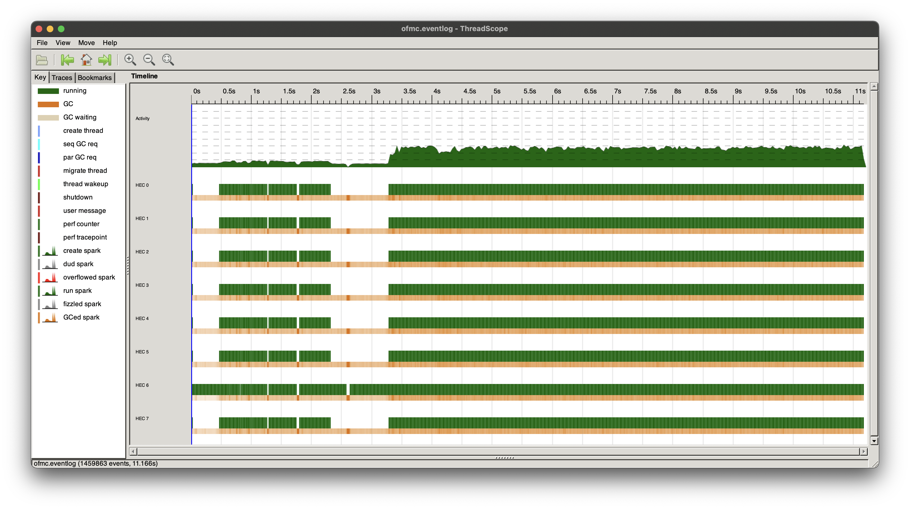

# Parallel OFMC

[](https://github.com/JakuJ/ofmc-parallel/actions/workflows/ci.yml)

This repository contains the source code for the [Open-source Fixed-point Model Checker](https://www.imm.dtu.dk/~samo/) extended with parallel processing capabilities.

This version of OFMC utilises all available cores during both the BFS and the DFS phases and can achieve massive speedups depending on the number of cores.

Instructions are provided for running locally, as well as on the DTU HPC cluster.

## Performance

Tested on an 8-core CPU (2 x 2064MHz + 6 x 3228MHz), both versions of OFMC executed with `--numSess 2` on an example protocol:

|             | OFMC  | Parallel OFMC | speedup |
| ----------- | :---: | ------------- | ------- |
| **typed**   |  50s  | 11s           | 4,55    |
| **untyped** |  47m  | 8m            | 5,86    |

The workload seems to be evenly distributed across all 8 cores during both breadth-first and then depth-first searches:


## Requirements

- [The Haskell Tool Stack](https://docs.haskellstack.org/en/stable/README/)
- [Alex](https://www.haskell.org/alex/)
- [Happy](https://www.haskell.org/happy/)
- make
- (optional) [Threadscope](https://github.com/haskell/ThreadScope)

Alex, Happy and Threadscope can be installed using the `stack install` command. You might have to add some dependencies to `extra-deps` in `stack.yaml` for them to install, but you can remove those later.

## Build

Install lexer and parser generators if you haven't already:

```console
$ stack install alex
$ stack install happy
```

Generate parser source files and build OFMC:

```console
$ make
```
Copy the executable to PATH:

```console
$ stack install
```

## Run on the DTU HPC cluster

DTU students can run OFMC on the **LSF 10** High Performance Computing cluster:

1. Access the cluster over `ssh` [(instructions)](https://www.hpc.dtu.dk/?page_id=2501)
2. Clone this repository
3. Download a binary release of `stack` for Linux [here](https://docs.haskellstack.org/en/stable/install_and_upgrade/#manual-download_2)
4. Set the `STACK` variable in the Makefile to point to the `stack` executable
5. Follow the steps to build the project

`stack install` will print where the `ofmc` binary was copied to. You can add it to PATH for simplicity. Example:

```shell
export PATH="/zhome/f1/2/143603/.local/bin:$PATH"
```

You can execute OFMC on 20 cores and pray you don't get banned from using the HPC cluster ever again. **Alternatively**, you can learn how to [schedule a job properly](https://www.hpc.dtu.dk/?page_id=1416) :upside_down_face:
